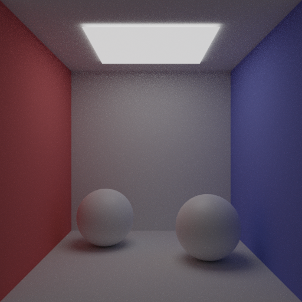
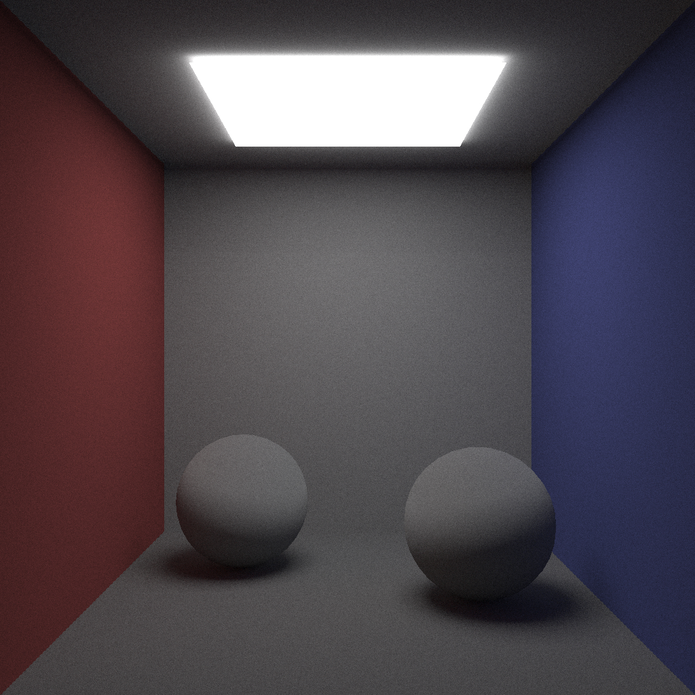

# RayTracing Discovery

This project aims at implementing a raytracing approach for photorealistic rendering


Ultimate goal(Cycles render) | V0
:-----------------: | :------------------:
  |  


---


## Dependency

This project uses different dependencies :

- [Assimp](https://github.com/assimp/assimp) : Used to load model files to render 
- [Eigen](http://eigen.tuxfamily.org/index.php?title=Main_Page) : Matrice and vector manipulation
- [Stbipp](https://github.com/Rodousse/stbipp) : Image I/O

---


## Install

Whole install instructions :
```
git clone https://github.com/Rodousse/PhotonMappingImplementation.git
# Third party install 
cd third_party
mkdir build
cd build
cmake -DCMAKE_INSTALL_PREFIX="Wherever/you/want" .. 
make
# Project build
cd ../../project
mkdir build
cd build
cmake -DCMAKE_PREFIX_PATH="thirdParty/install/path/" ..
make
```
